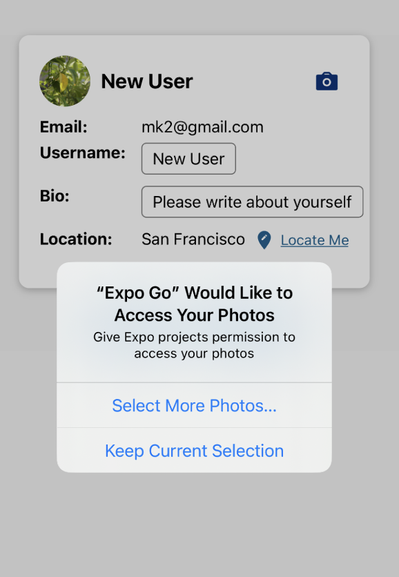
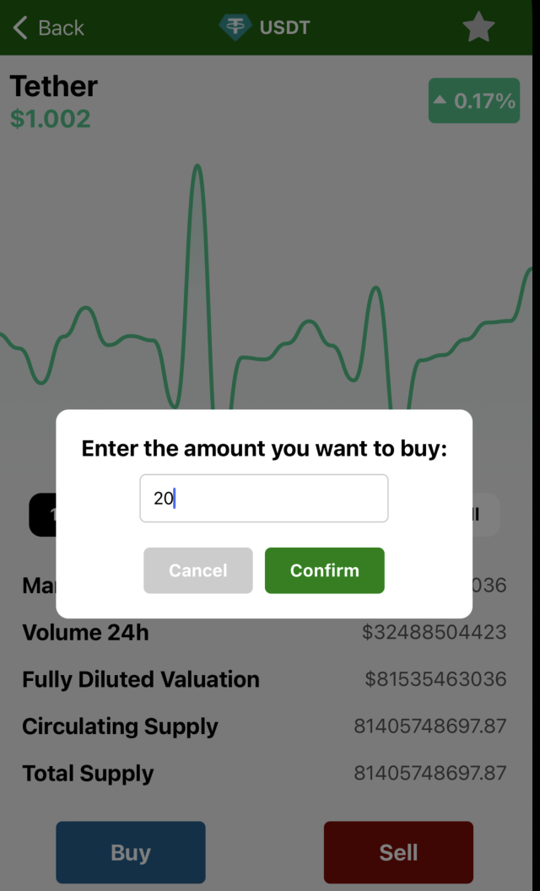

# GreenCrypto

## Team members: Chen Qiu, Maokun Sun, Qiuan Wu

### Iteration 1

Finished 2 navigators and basis of CRUD operations to Firestore.

Members' Contributions:

#### Chen Qiu

Drafted the Profile Page, connected it to Firestore, and fulfilled create and update profile functions.

#### Maokun Sun

Homepage BTC coin shown and app style/icon set-up.

#### Qiuan Wu

Created activity list and fulfilled add/remove activity functions.

### Iteration 2

Finished Functions:

1. External API use
2. Authentication
3. Camera use
4. Location use

Members' Contributions:
 

#### Chen Qiu

##### Camera use

##### Location use

 

#### Maokun Sun

##### Authentication

##### HomeCryptoMarket

 

#### Qiuan Wu

##### External API use

https://api.coingecko.com/api/

##### Coin Action

### Iteration 3

Finished Function:

1. Coins Buy/Sell Notification
2. My portfolio balance brief/fund add
3. Coins Buy/Sell Function to my portfilio
4. My portfolio portfolio list/wishlist
5. Public activity shown and design polish
6. My activity creat/remove to public and shown polish

Members' Contributions:
 

#### Chen Qiu

##### Fullfill Portfolio Page

<figure>
  
  <figcaption>Profile Balance and Default Page Set-UP</figcaption>
</figure>

<figure>
  
  <figcaption>Add Fund</figcaption>
</figure>

<figure>
  
  <figcaption>Buy/Sell Coin</figcaption>
</figure>

<figure>
  
  <figcaption>Add Wishlist</figcaption>
</figure>

<figure>
  
  <figcaption>Show Wishlist</figcaption>
</figure>

 

#### Maokun Sun

##### Buy/Sell Notification

<figure>
  
  <figcaption>Buy Notification</figcaption>
</figure>

<figure>
  
  <figcaption>Sell Notification</figcaption>
</figure>

<figure>
  
  <figcaption>Homepage Update</figcaption>
</figure>

 

#### Qiuan Wu

##### Fullfill Activity Page

<figure>
  
  <figcaption>Public Activity List</figcaption>
</figure>

<figure>
  
  <figcaption>Create My Activity to Public</figcaption>
</figure>

<figure>
  
  <figcaption>Remove My Activity from Public</figcaption>
</figure>
