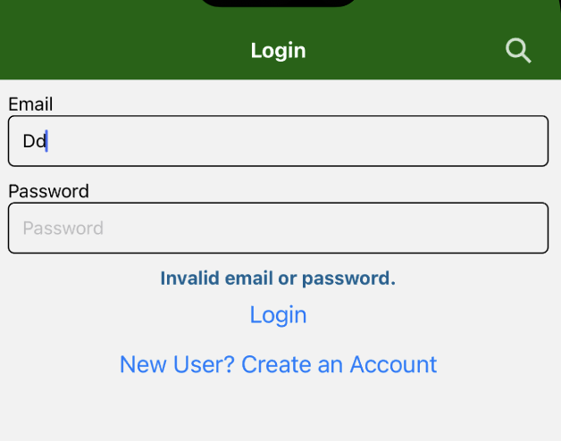

# GreenCrypto

## Team members: Chen Qiu, Maokun Sun, Qiuan Wu

### Iteration 1

Finished 2 navigators and basis of CRUD operations to Firestore.

Members' Contributions:

### Chen Qiu

Drafted the Profile Page, connected it to Firestore, and fulfilled create and update profile functions.

### Maokun Sun

Homepage BTC coin shown and app style/icon set-up.

### Qiuan Wu

Created activity list and fulfilled add/remove activity functions.

### Iteration 2

Finished Functions:

1. External API use
2. Authentication
3. Camera use
4. Location use

Members' Contributions:
 

### Chen Qiu

#### Camera use

#### Location use

 

### Maokun Sun

#### Authentication

#### HomeCryptoMarket

 

### Qiuan Wu

#### External API use

https://api.coingecko.com/api/

#### Coin Action

